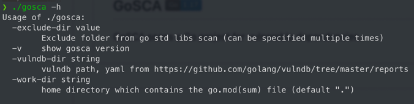
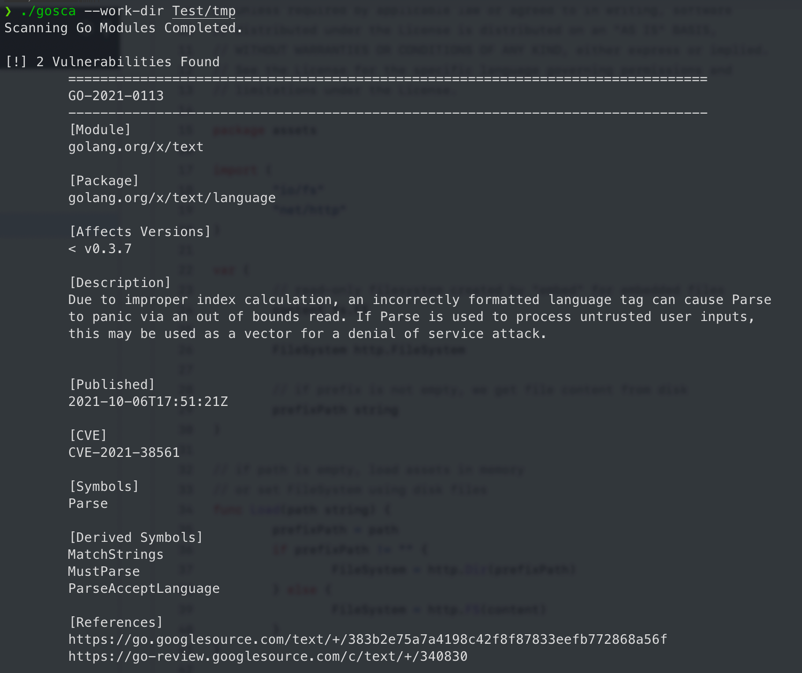

## GoSCA [](https://go.dev/)

GoSCA scans a Go project for vulnerable dependencies.

### Usage
```bash
./gosca -w /path/to/workdir
```



Running



### Download
Select your platform for download

https://github.com/TARI0510/gosca/releases

### Build
```bash
go build -o gosca cmd/gosca/main.go
```

or for cross platform builds
```bash
sh package.sh
```

### References
1. https://github.com/securego/gosec
2. https://github.com/fatedier/frp
